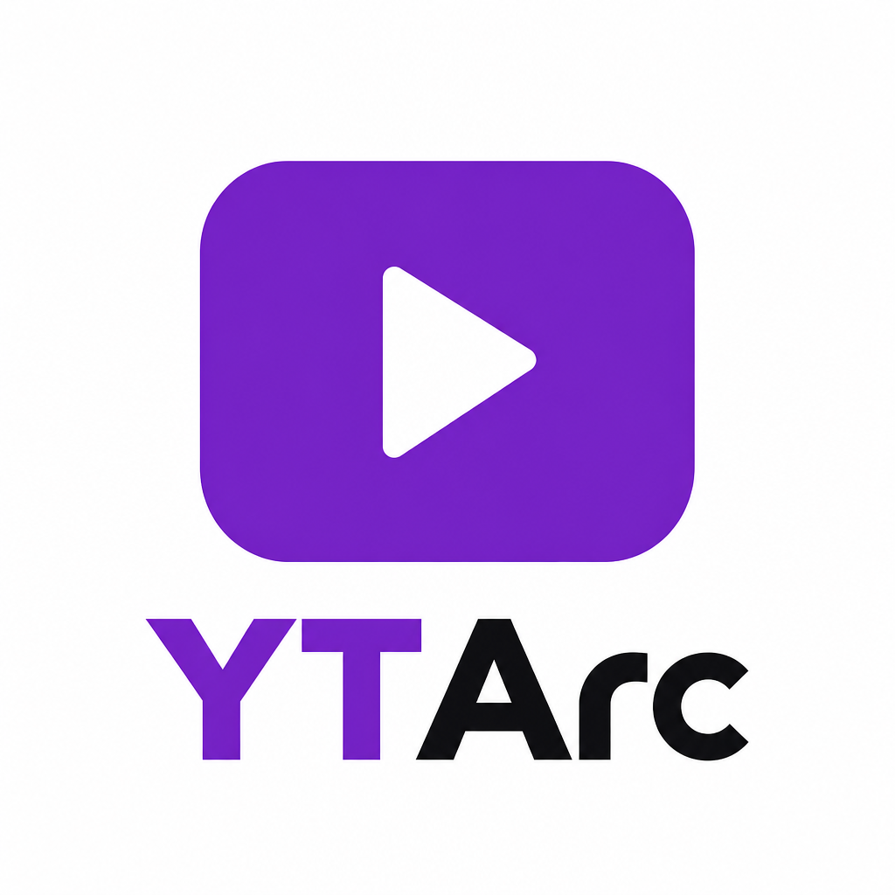
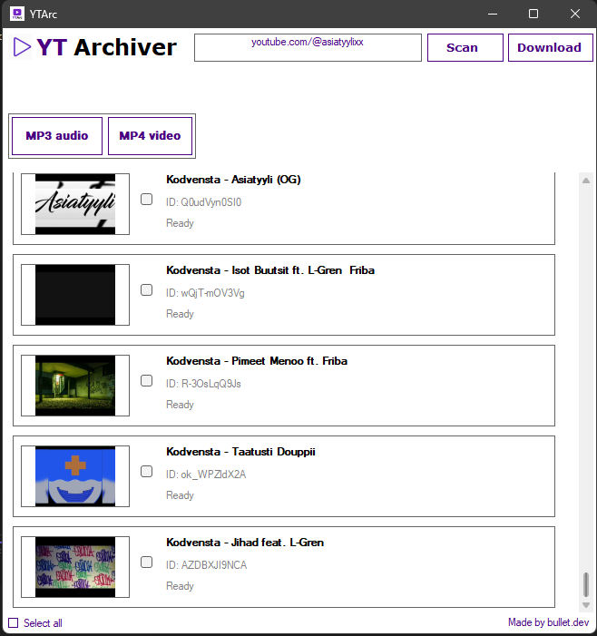

# YTArc — YoutubeArchiver

A simple Windows desktop application for downloading and archiving YouTube videos using **yt-dlp**.

YTArc provides a graphical interface for selecting videos from channels, playlists, or individual YouTube URLs and downloading them as **MP4 and/or MP3**.



---

## ✨ Features

- 📺 Load videos from YouTube channels
- 📋 Load videos from YouTube playlists
- 🎥 Download individual YouTube videos
- 🎬 Download videos as **MP4**
- 🎵 Extract audio as **MP3**
- 🖼️ Display video thumbnails
- ☑️ Select individual videos
- ☑️ Select all videos at once
- 📊 Live download status for each video
- 🔄 Handles MP4 and MP3 downloads independently
- 🛠️ Uses yt-dlp for reliable video extraction
- ⚡ Uses Deno for YouTube JavaScript challenges
- 🎞️ Uses FFmpeg for video/audio processing
- 📦 Portable — dependencies can be kept alongside the application

---

## 🖥️ Screenshot



---

## 📥 Supported URLs

YTArc currently supports:

### Single videos

```text
https://www.youtube.com/watch?v=VIDEO_ID
```

### Channels

```text
https://www.youtube.com/@ChannelName
```

### Playlists

```text
https://www.youtube.com/playlist?list=PLAYLIST_ID
```

---

## 🎬 Download Formats

### MP4

YTArc uses yt-dlp to select the best available video and audio streams and merge them into an MP4 file.

### MP3

YTArc extracts the audio and converts it to MP3 using FFmpeg.

You can select either format or download both.

---

## 📊 Download Status

Each video displays its current state directly in the application.

Examples:

```text
Ready
Downloading MP4...
Downloading MP3...
✓ Downloaded successfully
✓ MP4   ✗ MP3 failed
```

This makes it easy to see which videos failed without having to manually check the download folder.

---

## 🛠️ Requirements

YTArc is designed to run on Windows.

The application uses:

- **C# / Windows Forms**
- **yt-dlp**
- **Deno**
- **FFmpeg**
- **Newtonsoft.Json**


Recommended folder structure:

```text
YoutubeArchiver/
│
├── YoutubeArchiver.exe
├── yt-dlp.exe
├── deno.exe
├── ffmpeg.exe
└── ffprobe.exe
```

---

## 🚀 Getting Started

1. Download or build YTArc.
2. Make sure the required executables are located next to `YoutubeArchiver.exe`.
3. Launch `YoutubeArchiver.exe`.
4. Paste a YouTube channel, playlist, or video URL.
5. Click **Load Channel**.
6. Select the videos you want.
7. Select **MP4**, **MP3**, or both.
8. Click **Download Selected**.

---

## 🔧 Building From Source

### Requirements

- Visual Studio
- .NET Framework / compatible Windows Forms environment
- C#
- Newtonsoft.Json

Clone the repository:

```bash
git clone https://github.com/YOUR_USERNAME/YoutubeArchiver.git
```

Open the project in Visual Studio and build the solution.

After building, place the required executables in the same directory as the compiled application:

```text
yt-dlp.exe
deno.exe
ffmpeg.exe
ffprobe.exe
```

---

## 📦 Dependencies

### yt-dlp

YTArc uses [yt-dlp](https://github.com/yt-dlp/yt-dlp) as its YouTube extraction and downloading backend.

### Deno

[Deno](https://github.com/denoland/deno/) is used as the JavaScript runtime required by modern YouTube extraction.

### FFmpeg

[FFmpeg](https://www.ffmpeg.org/) is used by yt-dlp for tasks such as:

- Merging video and audio
- Audio extraction
- MP3 conversion

### Newtonsoft.Json

Newtonsoft.Json is used to parse the JSON output produced by yt-dlp.

---

## ⚠️ Known Issues

YouTube occasionally returns:

```text
HTTP Error 403: Forbidden
```

This can happen even when the exact same video succeeds on a subsequent attempt.

YTArc includes yt-dlp retry options, but some 403 errors are related to YouTube's access controls and cannot always be prevented by the application.

Failed downloads are displayed directly in the video panel so they can easily be retried.

---

## 🔒 Disclaimer

YTArc is a graphical frontend for yt-dlp.

Users are responsible for ensuring that their use of the software complies with YouTube's Terms of Service, copyright law, and any other applicable laws.

Only download content that you have permission to download.

---

## 🗺️ Roadmap

Possible future improvements:

- [ ] Download progress bars
- [ ] Download speed and ETA
- [ ] Custom download folder
- [ ] Pause/resume downloads
- [ ] Automatic retry of failed videos
- [ ] More output formats
- [ ] Queue management
- [ ] Concurrent downloads

---

## 🤝 Contributing

Contributions, bug reports, and suggestions are welcome.

If you find a bug or have an idea for a feature, feel free to open an issue or submit a pull request.

---

## 💻 Built With

**C# • Windows Forms • yt-dlp • Deno • FFmpeg • Newtonsoft.Json**

### YTArc

> **Archive YouTube. Your way.**
